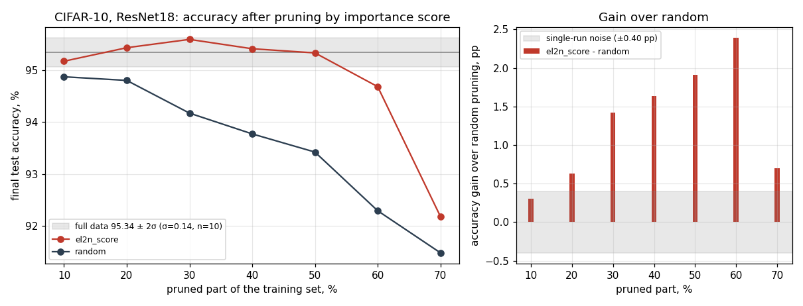
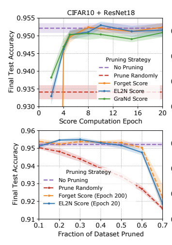

# HW2 — Deep Learning on a Data Diet (EL2N / GraNd), CIFAR-10 + ResNet18

Статья: [arXiv 2107.07075](https://arxiv.org/abs/2107.07075). Код: [data_diet_pytorch/](data_diet_pytorch/) — PyTorch-порт
официального JAX-кода ([mansheej/data_diet](https://github.com/mansheej/data_diet)), который на текущих JAX/Flax не запускается по причине несовместимости и несуществования базового образа Docker.
GPU: RTX 5070 Ti 16 GB, PyTorch 2.14.1+cu132, bf16.

## Что сделано
- сетка и обучение 
  - ResNet18 (low-res)
  - SGD + Nesterov, lr 0.1 (÷5 на 60/120/160 эпохах), wd 5e-4  
  - батч 128
  - 78 000 шагов
    при любом размере выборки, аугментация как в оригинале.
- 10 независимых полных запусков (200 эпох): на каждой из 10 эпох (0…200) для каждого примера сохранены EL2N, GraNd, forgetting, плюс чекпойнты. Для удобства mlflow (`data-diet-score-collection`).
- Прунинг по усреднённому по запускам скору: EL2N на эпохе 20 и forgetting на эпохе 200; убирается доля 0.1…0.7 примеров с  наименьшим скором
-  контроль — случайный отбор того же размера (`data-diet-pruning`).

## Результат

Полные данные (10 seed'ов): **95.34 ± 0.14 %**. Прунинг, final test accuracy, %, 
**использовался один seed** :

| удалено fraction | EL2N@20 | Forgetting@200 | Random |
|---|---|---|---|
| 10% | 95.17 | 95.52 | 94.87 |
| 20% | 95.43 | 95.45 | 94.80 |
| 30% | 95.59 | 95.24 | 94.17 |
| 40% | 95.41 | 95.32 | 93.77 |
| **50%** | **95.33** | **95.59** | 93.42 |
| 60% | 94.68 | 95.22 | 92.29 |
| 70% | 92.18 | 92.98 | 91.48 |



## Сравнение со статьёй



верхний рисунок приложен для выбора эпохи для подсчёта скоров. По дефолту для экспериментов брали 20 эпоху снятия метрик.   
по рисунку: полные данные ≈ 95.2 % (у нас 95.34), random убывает до ≈ 91.5–92 % при 70 %
(у нас 91.48).

Что совпало: 
- половину CIFAR-10 можно убрать по EL2N@20 без потери (95.33 против 95.34 %).
- EL2N лучше случайного отбора при тех же размерах (разница значима с 20 %, до +2.4 п.п. при 60 %).
- резкий провал при сильном прунинге (−3.2 п.п. между 50 и 70 %).
-  EL2N@20 «конкурентен» forgetting@200 — до 50 % различие ≤ 0.35 п.п. (в пределах шума ±0.4); при 60–70 %
  forgetting лучше на 0.5–0.8 п.п. При этом EL2N@20 считается по 20 эпохам вместо 200 (в 10 раз дешевле).
- скор нужно усреднять по запускам: Спирмен одного запуска со средним по 10 равен 0.78 (EL2N@20), в статье
  ≈ 0.75 (GraNd на инициализации).
- Частично: авторы показывают, что при 20–40 % EL2N слегка выше полных данных (≈ +0.3 п.п. по рисунку). У нас те же
  +0.1…+0.25 п.п. (максимум 30 %, 1.7σ), но при одном seed это в пределах шума, статистически не подтверждено.
- Отличие: при 70 % в статье EL2N и forgetting сходятся к random (≈ 91.5–92 %), у нас остаются выше (92.18 и 92.98 против
  91.48 %); возможные причины: bf16, один seed, детали усреднения скоров.

## Вывод

Основные утверждения статьи подтверждаются на CIFAR-10: ранний (20-я эпоха) скор EL2N позволяет удалить до 50 % данных
без потери точности и стабильно лучше случайного отбора. На агрессивном прунинге (≥ 60 %) forgetting из полного обучения
всё же лучше. Все различия получены на одном seed; надёжны те, что превышают шум базовых прогонов.

## Что сокращено

- 1 seed на точку вместо 4 в статье.
- GraNd как критерий прунинга не прогонялся (скоры собраны, на эпохе 20 коррелируют с EL2N на 0.99). т.е. предложенная метрика замены более сложного подсчёта суммы норм градиентов оправдано заменяется на  EL2N. Отсутствие корреляции векторов градиентов  между метками позволяют нам это сделать (свойство CE). 
- Только CIFAR-10 + ResNet18: нет CIFAR-100 + ResNet50 и CINIC-10.
- Нет экспериментов «насколько рано можно считать скор» (прунинг по скорам эпох 0…16), «шум меток / окно по смещению» -- тут на веру,   
  переноса скоров между архитектурами, NTK и linear mode  connectivity -- related work.
- bf16 вместо fp32 и недетерминированный cuDNN (`benchmark=True`): запуски с одним seed не повторяемы.
  Совпадение с fp32 не проверялось (базовая точность 95.34 % совпадает с ожидаемой).

## Запуск

CIFAR-10 берётся из `CIFAR10_ROOT` (по умолчанию `~/Downloads/data`). Окружение создаётся из [environment.yml](environment.yml)
(`conda env create -f environment.yml && conda activate data_diet`, нужна NVIDIA GPU), команды запускаются из
`data_diet_pytorch/`.

```
python collect_scores.py                  # 10 прогонов по 200 эпох со всеми скорами
python aggregate_scores.py                # среднее по запускам, надёжность, графики
python run_pruning_sweep.py               # EL2N + random, доли 0.1…0.7,
python run_pruning_sweep.py --score-types forgetting_score --score-epoch 200
python collect_pruning_results.py 
python plot_pruning_results.py
mlflow ui --backend-store-uri sqlite:///../mlflow.db
```

Чекпойнты, сырые скоры и mlflow в git не входят
 в data_diet_pytorch/results/ лежат  результаты.
